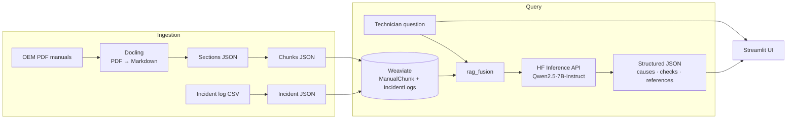

# 🛠️ Technician Helper

[](https://github.com/adixg/technician_helper/actions/workflows/ci.yml)
[](pyproject.toml)
[](LICENSE)

> A Retrieval-Augmented Generation (RAG) assistant that helps maintenance technicians
> troubleshoot machine faults using OEM manuals and historical incident logs.

Technician Helper ingests equipment manuals (PDF) and predictive-maintenance incident
logs (CSV) into a vector database, then answers free-text troubleshooting questions with
a **structured, evidence-grounded response** — likely causes, recommended checks, relevant
manual sections, and similar past incidents — served through a Streamlit web app.

---

## Table of contents

- [Features](#features)
- [How it works](#how-it-works)
- [Tech stack](#tech-stack)
- [Project structure](#project-structure)
- [Getting started](#getting-started)
- [Data pipelines](#data-pipelines)
- [Running the app](#running-the-app)
- [Configuration](#configuration)
- [Evaluation](#evaluation)
- [Development](#development)
- [Module reference](#module-reference)

---

## Features

- **PDF manual ingestion** – convert OEM PDFs to Markdown, split into sections and
  embedding-ready chunks, and index them in Weaviate.
- **Incident log ingestion** – normalize a maintenance incident CSV into structured,
  searchable records.
- **Semantic retrieval** – vector search over both manuals and incident history.
- **RAG fusion pipeline** – combines manual + incident evidence into a single prompt and
  returns a validated JSON answer (causes, checks, references, escalation flag,
  confidence).
- **Streamlit UI** – one interface to ingest manuals, log new incidents, run retrieval,
  and execute the full troubleshooting pipeline with live stage-by-stage progress.

---

## How it works



The retrieval pipeline (`technician_helper.pipeline.rag_fusion.run_rag_fusion`):

1. Retrieve top-k manual chunks from the **ManualChunk** collection.
2. Retrieve top-k historical incidents from the **IncidentLogs** collection.
3. Sanitize and format the evidence into a single prompt.
4. Call the LLM via the Hugging Face Inference API.
5. Extract and schema-validate the JSON response before returning it.

---

## Tech stack

| Layer        | Technology                                             |
| ------------ | ------------------------------------------------------ |
| Interface    | Streamlit                                             |
| Vector DB    | Weaviate (run locally via Docker)                     |
| Embeddings   | `sentence-transformers/all-MiniLM-L6-v2`              |
| PDF parsing  | Docling                                               |
| LLM          | `Qwen/Qwen2.5-7B-Instruct` via Hugging Face Inference API |
| Config       | `pydantic-settings`                                   |
| Tooling      | `ruff`, `pytest`, `hatchling`                         |
| Language     | Python 3.11+                                          |

---

## Project structure

```
technician_helper/
├── pyproject.toml                     # Packaging, dependencies, ruff + pytest config
├── docker-compose.yml                 # Weaviate + app, one command
├── Dockerfile
├── src/technician_helper/
│   ├── config.py                      # Centralised settings (env-overridable)
│   ├── clients.py                     # Shared Weaviate client factory
│   ├── embeddings.py                  # Cached SentenceTransformer loader
│   ├── retry.py                       # Backoff helper
│   ├── tracking.py                    # Local experiment tracking (+ optional MLflow)
│   ├── app.py                         # Streamlit application
│   ├── ingestion/
│   │   ├── pdf_to_markdown.py         # PDF → Markdown (Docling)
│   │   ├── markdown_to_sections.py    # Markdown → sections JSON
│   │   ├── sections_to_chunks.py      # sections JSON → chunk JSON
│   │   ├── incident_csv_to_json.py    # incident CSV → structured JSON
│   │   └── incident_record.py         # insert a single incident (used by app.py)
│   ├── vectorstore/
│   │   ├── manual_collection.py       # create the ManualChunk schema
│   │   ├── incident_collection.py     # create the IncidentLogs schema
│   │   ├── upload_manual_chunks.py    # embed + upload manual chunks
│   │   └── upload_incident_json.py    # embed + upload incident records
│   ├── retrieval/
│   │   ├── manuals.py                 # semantic search over ManualChunk
│   │   └── incidents.py               # semantic search over IncidentLogs
│   ├── pipeline/
│   │   └── rag_fusion.py              # full troubleshooting pipeline
│   └── evals/                         # metrics, runner, report, `th-eval` CLI
├── evals/                            # golden dataset, fixtures, thresholds, baseline
├── scripts/check_ollama.py           # ad-hoc HF Inference API connectivity check
├── tests/                            # pytest unit tests
└── data/
    ├── manuals/                      # source PDFs (tracked)
    ├── logs/                         # incident CSV (tracked)
    └── manuals_converted/ …          # pipeline output (git-ignored, regenerable)
```

---

## Getting started

### Prerequisites

- Python **3.11+**
- **Docker** (to run Weaviate locally)
- A free **Hugging Face** account and access token (for the Inference API)

### 1. Clone and install

```bash
git clone https://github.com/adixg/technician_helper.git
cd technician_helper

python -m venv .venv
source .venv/bin/activate        # Windows: .venv\Scripts\activate

pip install -e ".[dev]"
```

### 2. Configure environment

```bash
cp .env.example .env
```

Then edit `.env` and set your `HF_TOKEN`. All other settings have sensible defaults
(see [Configuration](#configuration)).

### 3. Start Weaviate

**Docker Compose (recommended)** brings up Weaviate and the app together:

```bash
HF_TOKEN=your_token docker compose up --build
```

The app is then on <http://localhost:8501>. To run only Weaviate, use
`docker compose up weaviate`.

<details>
<summary>Plain <code>docker run</code> (Weaviate only)</summary>

```bash
docker run -d --name weaviate -p 8080:8080 -p 50051:50051 \
  -v "$(pwd)/weaviate_data:/var/lib/weaviate" \
  -e QUERY_DEFAULTS_LIMIT=20 \
  -e AUTHENTICATION_ANONYMOUS_ACCESS_ENABLED=true \
  -e DEFAULT_VECTORIZER_MODULE=none \
  semitechnologies/weaviate:latest
```

</details>

### 4. Load data

Run the [data pipelines](#data-pipelines) to populate the vector database, then start
the app.

---

## Data pipelines

Installing the package exposes a set of `th-*` console commands (equivalent to
`python -m technician_helper.<module>`).

### Manual ingestion

```bash
th-pdf-to-markdown "data/manuals/manual.pdf"
th-markdown-to-sections "data/manuals_converted/manual-with-image-refs.md"
th-sections-to-chunks "data/manuals_sections/manual-sections.json" --max_chars 2000 --min_chars 200
th-create-manual-collection                       # run once
th-upload-manuals "data/manuals_chunks/manual-chunks.json"
```

### Incident log ingestion

```bash
th-incident-csv data/logs/predictive-maintenance-incident-log.csv
th-create-incident-collection                     # run once
th-upload-incidents data/logs/incident_chunks.json
```

---

## Running the app

```bash
streamlit run src/technician_helper/app.py
```

Then open <http://localhost:8501>.

**With Docker Compose:**

```bash
HF_TOKEN=your_token docker compose up --build
```

---

## Configuration

All settings live in [`src/technician_helper/config.py`](src/technician_helper/config.py)
and can be overridden via environment variables or `.env`:

| Variable                | Default                                    | Purpose                              |
| ----------------------- | ------------------------------------------ | ----------------------------------- |
| `HF_TOKEN`              | –                                          | Hugging Face token (required)       |
| `WEAVIATE_HOST`         | `localhost`                                | Weaviate host                       |
| `WEAVIATE_HTTP_PORT`    | `8080`                                     | Weaviate REST port                  |
| `WEAVIATE_GRPC_PORT`    | `50051`                                    | Weaviate gRPC port                  |
| `MANUAL_COLLECTION`     | `ManualChunk`                              | Manual chunk collection name        |
| `INCIDENT_COLLECTION`   | `IncidentLogs`                             | Incident log collection name        |
| `EMBED_MODEL`           | `sentence-transformers/all-MiniLM-L6-v2`   | Embedding model                     |
| `LLM_MODEL`             | `Qwen/Qwen2.5-7B-Instruct`                 | Fusion LLM (HF Inference API)       |
| `LLM_TIMEOUT`           | `60`                                       | Per-request LLM timeout (seconds)   |
| `LLM_MAX_ATTEMPTS`      | `3`                                        | Network retries per LLM call        |
| `LLM_REPAIR_ATTEMPTS`   | `2`                                        | Re-asks when the model breaks schema|
| `WEAVIATE_CONNECT_ATTEMPTS` | `5`                                   | Connection retries (with backoff)   |
| `LOG_LEVEL`             | `INFO`                                     | Root log level                      |
| `EVAL_K`               | `5`                                        | Retrieval cutoff for recall@k / MRR |
| `MLFLOW_ENABLED`       | `false`                                    | Also log eval runs to MLflow        |
| `RUNS_DIR`             | `runs`                                     | Local experiment-tracking store     |

### Reliability behaviour

- **Embedding model is loaded once** per process and reused across queries (it was
  previously reloaded on every request).
- **The Weaviate connection is shared** process-wide, opened with retry + backoff, and
  closed at exit.
- **LLM calls** run under a timeout and are retried on transient network errors; if the
  response fails schema validation, the pipeline re-asks with the error up to
  `LLM_REPAIR_ATTEMPTS` times.
- **Uploads are idempotent** — records use deterministic UUIDs keyed on `chunk_id`, so
  re-running an ingest upserts instead of creating duplicates.
- **The app fails fast** at startup with a clear message if `HF_TOKEN` is missing or
  Weaviate is unreachable.

---

## Evaluation

`th-eval` scores the pipeline against a labelled golden dataset and gates
regressions. Metrics cover **retrieval** (recall@k, hit-rate, MRR), **answer
quality** (schema validity, groundedness, field match, completeness), and
**errors / latency**, with a per-slice breakdown (`machine_type`, `category`).

```bash
th-eval score                                              # offline — recompute from committed fixtures
th-eval score --baseline evals/reports/baseline.json --gate  # fail on regression (used in CI)
th-eval run                                                # live pipeline; refresh fixtures + log the run
th-runs                                                    # eval metrics over time
```

Committed fixtures (`evals/fixtures/`) let `th-eval score` and CI run without
Weaviate or a token. Each `run` logs params + aggregate metrics to
`runs/index.jsonl` (and to MLflow when `MLFLOW_ENABLED=true`). Full details and
metric definitions: [`EVALUATION.md`](EVALUATION.md).

---

## Development

```bash
pip install -e ".[dev]"

pytest --cov=technician_helper   # unit tests + coverage
ruff check .                     # lint
ruff format .                    # format
th-eval score                    # offline evaluation
```

---

## Module reference

<details>
<summary><strong>Click to expand per-module documentation</strong></summary>

### `app.py`

Main Streamlit application. UI for ingesting PDF manuals, adding incident log entries,
running manual/incident retrieval, and executing the full troubleshooting pipeline.

```bash
streamlit run src/technician_helper/app.py
```

### `pipeline/rag_fusion.py`

Runs the full troubleshooting pipeline: retrieve manual evidence → retrieve incident
evidence → build prompt → call LLM → extract and validate structured JSON.

```python
from technician_helper.pipeline.rag_fusion import run_rag_fusion

result = run_rag_fusion(query="Pump vibration after restart")
```

CLI: `th-rag-fusion --query "Pump vibration after restart" --debug`

### `ingestion/pdf_to_markdown.py`

Converts a PDF manual into Markdown using Docling, extracting figures, tables, and image
references. CLI: `th-pdf-to-markdown "data/manuals/manual.pdf" [--output_dir DIR]`

### `ingestion/markdown_to_sections.py`

Splits a Markdown manual into structured **sections JSON** (title, text, image
references). CLI: `th-markdown-to-sections "…-with-image-refs.md" [--output_dir DIR]`

### `ingestion/sections_to_chunks.py`

Splits a sections JSON file into smaller embedding-ready **chunks JSON**.
CLI: `th-sections-to-chunks "…-sections.json" [--max_chars N] [--min_chars N]`

### `ingestion/incident_csv_to_json.py`

Converts an incident log CSV into structured JSON records (datetime normalization,
numeric cleaning, text-field generation). CLI: `th-incident-csv <csv> [--output_json PATH]`

### `ingestion/incident_record.py`

Utility module for inserting a **single** incident record into Weaviate (record
construction, embedding, upload, optional CSV persistence). Used by `app.py`.

```python
from technician_helper.ingestion.incident_record import (
    build_incident_record_from_form,
    upload_single_incident_to_weaviate,
)
```

### `vectorstore/manual_collection.py` · `vectorstore/incident_collection.py`

Create the **ManualChunk** / **IncidentLogs** collection schemas in Weaviate. Run once
before uploading. CLI: `th-create-manual-collection`, `th-create-incident-collection`

### `vectorstore/upload_manual_chunks.py` · `vectorstore/upload_incident_json.py`

Embed chunk / incident JSON and upload it to the corresponding collection.
CLI: `th-upload-manuals <chunks.json>`, `th-upload-incidents <incidents.json>`
(both accept `--collection_name` and `--embed_model`).

### `retrieval/manuals.py` · `retrieval/incidents.py`

Semantic search over the **ManualChunk** / **IncidentLogs** collections.

```python
from technician_helper.retrieval.manuals import semantic_query

results = semantic_query(question="How should the motor be grounded?", top_k=5)
```

CLI: `th-query-manuals --query "motor grounding" --top_k 3`,
`th-query-incidents --query "bearing vibration on pump" --top_k 3`

### `scripts/check_ollama.py`

Ad-hoc connectivity check against the Hugging Face Inference API. Not part of the test
suite. Run with `python scripts/check_ollama.py`.

</details>
