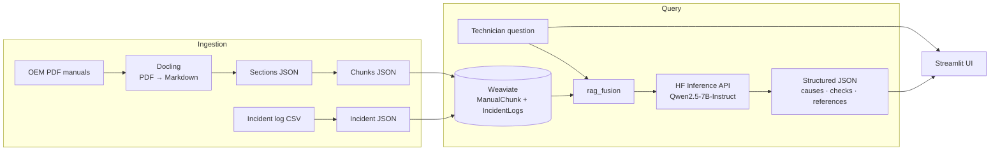

# 🛠️ Technician Helper

> A Retrieval-Augmented Generation (RAG) assistant that helps maintenance technicians
> troubleshoot machine faults using OEM manuals and historical incident logs.

Technician Helper ingests equipment manuals (PDF) and predictive-maintenance incident
logs (CSV) into a vector database, then answers free-text troubleshooting questions with
a **structured, evidence-grounded response** — likely causes, recommended checks, relevant
manual sections, and similar past incidents — served through a Streamlit web app.

---

## Table of contents

- [Features](#features)
- [How it works](#how-it-works)
- [Tech stack](#tech-stack)
- [Project structure](#project-structure)
- [Getting started](#getting-started)
- [Data pipelines](#data-pipelines)
- [Running the app](#running-the-app)
- [Configuration](#configuration)
- [Module reference](#module-reference)

---

## Features

- **PDF manual ingestion** – convert OEM PDFs to Markdown, split into sections and
  embedding-ready chunks, and index them in Weaviate.
- **Incident log ingestion** – normalize a maintenance incident CSV into structured,
  searchable records.
- **Semantic retrieval** – vector search over both manuals and incident history.
- **RAG fusion pipeline** – combines manual + incident evidence into a single prompt and
  returns a validated JSON answer (causes, checks, references, escalation flag,
  confidence).
- **Streamlit UI** – one interface to ingest manuals, log new incidents, run retrieval,
  and execute the full troubleshooting pipeline with live stage-by-stage progress.

---

## How it works



The retrieval pipeline (`rag_fusion.run_rag_fusion`):

1. Retrieve top-k manual chunks from the **ManualChunk** collection.
2. Retrieve top-k historical incidents from the **IncidentLogs** collection.
3. Sanitize and format the evidence into a single prompt.
4. Call the LLM via the Hugging Face Inference API.
5. Extract and schema-validate the JSON response before returning it.

---

## Tech stack

| Layer        | Technology                                             |
| ------------ | ------------------------------------------------------ |
| Interface    | Streamlit                                             |
| Vector DB    | Weaviate (run locally via Docker)                     |
| Embeddings   | `sentence-transformers/all-MiniLM-L6-v2`              |
| PDF parsing  | Docling                                               |
| LLM          | `Qwen/Qwen2.5-7B-Instruct` via Hugging Face Inference API |
| Language     | Python 3.11+                                          |

---

## Project structure

```
technician_helper/
├── app.py                      # Streamlit application (main entry point)
├── rag_fusion.py               # Full troubleshooting RAG pipeline
│
├── docling_code.py             # PDF → Markdown (+ figures/tables/images)
├── sections_json_gen.py        # Markdown → sections JSON
├── chunks_json_gen.py          # sections JSON → embedding-ready chunks
├── create_manual_collection.py # Create the ManualChunk schema in Weaviate
├── upload_manual_chunks.py     # Embed + upload manual chunks
├── query_manuals.py            # Semantic search over ManualChunk
│
├── create_incident_json.py     # Incident CSV → structured JSON
├── create_log_collection.py    # Create the IncidentLogs schema in Weaviate
├── upload_incident_json.py     # Embed + upload incident records
├── incident_ingest.py          # Insert a single incident (used by app.py)
├── query_incident_logs.py      # Semantic search over IncidentLogs
│
├── test_ollama.py              # Local Ollama connectivity check
├── requirements.txt
├── Dockerfile                  # Containerized Streamlit app
└── data/
    ├── manuals/                # Source PDFs
    ├── manuals_converted/      # Docling Markdown output
    ├── manuals_sections/       # Sections JSON
    ├── manuals_chunks/         # Chunks JSON
    └── logs/                   # Incident CSV + JSON
```

---

## Getting started

### Prerequisites

- Python **3.11+**
- **Docker** (to run Weaviate locally)
- A free **Hugging Face** account and access token (for the Inference API)

### 1. Clone and install

```bash
git clone https://github.com/adixg/technician_helper.git
cd technician_helper

python -m venv .venv
source .venv/bin/activate        # Windows: .venv\Scripts\activate

pip install -r requirements.txt
```

### 2. Configure environment

Create a `.env` file in the project root:

```bash
HF_TOKEN=your_huggingface_token
```

### 3. Start Weaviate

**Windows (PowerShell):**

```powershell
docker run -d --name weaviate -p 8080:8080 -p 50051:50051 `
  -v "${PWD}\weaviate_data:/var/lib/weaviate" `
  -e QUERY_DEFAULTS_LIMIT=20 `
  -e AUTHENTICATION_ANONYMOUS_ACCESS_ENABLED=true `
  -e DEFAULT_VECTORIZER_MODULE=none `
  semitechnologies/weaviate:latest
```

**Linux / macOS:**

```bash
docker run -d --name weaviate -p 8080:8080 -p 50051:50051 \
  -v "$(pwd)/weaviate_data:/var/lib/weaviate" \
  -e QUERY_DEFAULTS_LIMIT=20 \
  -e AUTHENTICATION_ANONYMOUS_ACCESS_ENABLED=true \
  -e DEFAULT_VECTORIZER_MODULE=none \
  semitechnologies/weaviate:latest
```

Weaviate is now reachable at `http://localhost:8080` (REST) and `localhost:50051` (gRPC).

### 4. Load data

Run the [data pipelines](#data-pipelines) below to populate the vector database, then
start the app.

---

## Data pipelines

### Manual ingestion

```bash
# 1. Convert PDF → Markdown
python docling_code.py "data/manuals/manual.pdf"

# 2. Markdown → sections JSON
python sections_json_gen.py "data/manuals_converted/manual-with-image-refs.md"

# 3. Sections JSON → chunks JSON
python chunks_json_gen.py "data/manuals_sections/manual-sections.json" \
    --max_chars 2000 --min_chars 200

# 4. Create the Weaviate collection (run once)
python create_manual_collection.py

# 5. Embed + upload
python upload_manual_chunks.py "data/manuals_chunks/manual-chunks.json"
```

### Incident log ingestion

```bash
# 1. Normalize CSV → structured JSON
python create_incident_json.py data/logs/predictive-maintenance-incident-log.csv

# 2. Create the Weaviate collection (run once)
python create_log_collection.py

# 3. Embed + upload
python upload_incident_json.py data/logs/incident_chunks.json
```

---

## Running the app

```bash
streamlit run app.py
```

Then open [http://localhost:8501](http://localhost:8501).

**With Docker:**

```bash
docker build -t technician-helper .
docker run -p 8501:8501 --env-file .env technician-helper
```

---

## Configuration

| Variable / setting | Where            | Purpose                                            |
| ------------------ | ---------------- | ------------------------------------------------- |
| `HF_TOKEN`         | `.env`           | Hugging Face token for embeddings + Inference API |
| Weaviate host/port | `localhost:8080` / `50051` | Vector database connection (hard-coded)  |
| Streamlit port     | `8501`           | Web UI                                            |

Common overridable CLI arguments across the pipeline scripts:

| Argument           | Applies to                              | Default                                   |
| ------------------ | --------------------------------------- | ----------------------------------------- |
| `--output_dir`     | `docling_code`, `sections_json_gen`, `chunks_json_gen` | script-specific            |
| `--max_chars` / `--min_chars` | `chunks_json_gen`             | `2000` / `200`                            |
| `--collection_name`| `upload_incident_json`, `upload_manual_chunks` | `IncidentLogs` / `ManualChunk`    |
| `--embed_model`    | `upload_incident_json`, `upload_manual_chunks` | `all-MiniLM-L6-v2`                 |
| `--batch_size`     | `upload_manual_chunks`                  | `2`                                       |

---

## Module reference

<details>
<summary><strong>Click to expand per-file documentation</strong></summary>

### `app.py`

Main Streamlit application. Provides UI for ingesting PDF manuals, adding incident log
entries, running manual/incident retrieval, and executing the full troubleshooting
pipeline.

```bash
streamlit run app.py
```

### `rag_fusion.py`

Runs the full troubleshooting pipeline: retrieve manual evidence → retrieve incident
evidence → build prompt → call LLM → extract and validate structured JSON. Used by
`app.py`.

```python
from rag_fusion import run_rag_fusion

result = run_rag_fusion(query="Pump vibration after restart")
```

CLI:

```bash
python rag_fusion.py --query "Pump vibration after restart" --debug
```

### `docling_code.py`

Converts PDF manuals into Markdown using Docling, extracting figures, tables, and image
references.

```bash
python docling_code.py "data/manuals/manual.pdf" --output_dir data/manuals_converted
```

### `sections_json_gen.py`

Splits a Markdown manual into structured **sections JSON**. Each section contains a title,
text, and image references.

```bash
python sections_json_gen.py "data/manuals_converted/manual-with-image-refs.md" \
    --output_dir data/manuals_sections
```

### `chunks_json_gen.py`

Splits a **sections JSON** file into smaller embedding-ready **chunks JSON**.

```bash
python chunks_json_gen.py "data/manuals_sections/manual-sections.json" \
    --output_dir data/manuals_chunks --max_chars 2000 --min_chars 200
```

### `create_manual_collection.py`

Creates the **ManualChunk** collection schema in Weaviate. Run once before uploading
manual chunks.

```bash
python create_manual_collection.py
```

### `upload_manual_chunks.py`

Embeds manual chunk JSON and uploads it into the **ManualChunk** collection.

```bash
python upload_manual_chunks.py data/manuals_chunks/manual-chunks.json \
    --collection_name ManualChunk \
    --embed_model Qwen/Qwen3-Embedding-0.6B \
    --batch_size 2
```

### `query_manuals.py`

Semantic search over the **ManualChunk** collection; returns relevant manual sections.

```python
from query_manuals import semantic_query

results = semantic_query(question="How should the motor be grounded?", top_k=5)
```

```bash
python query_manuals.py --query "motor grounding procedure" --top_k 3
```

### `create_incident_json.py`

Converts an incident log CSV into structured JSON records suitable for embedding
(datetime normalization, numeric cleaning, text-field generation for semantic search).

```bash
python create_incident_json.py data/logs/predictive-maintenance-incident-log.csv \
    --output_json data/logs/incident_chunks.json
```

### `create_log_collection.py`

Creates the **IncidentLogs** collection schema in Weaviate. Run once before uploading
incident JSON.

```bash
python create_log_collection.py
```

### `upload_incident_json.py`

Embeds incident JSON records and uploads them into the **IncidentLogs** collection.

```bash
python upload_incident_json.py data/logs/incident_chunks.json \
    --collection_name IncidentLogs \
    --embed_model sentence-transformers/all-MiniLM-L6-v2
```

### `incident_ingest.py`

Utility module for inserting **single incident records** into Weaviate (record
construction, embedding, upload, optional CSV persistence). Used by `app.py`.

```python
from incident_ingest import (
    build_incident_record_from_form,
    upload_single_incident_to_weaviate,
)
```

### `query_incident_logs.py`

Semantic search over the **IncidentLogs** collection; returns similar historical
incidents.

```python
from query_incident_logs import semantic_query

results = semantic_query(query_text="fault code E102 vibration", top_k=5)
```

```bash
python query_incident_logs.py --query "bearing vibration on pump" --top_k 3
```

### `test_ollama.py`

Test script for verifying local Ollama model availability (installation, inference
connectivity, prompt response behavior).

```bash
python test_ollama.py
```

</details>
