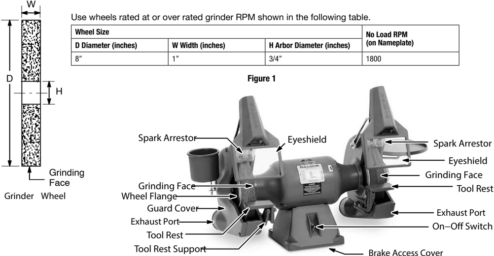
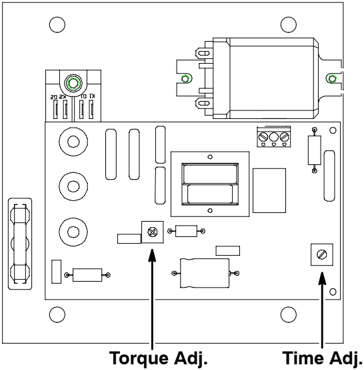

## SAFETY NOTICE:

WARNING statements describe conditions that may lead to personnel injury including potentially fatal injuries if the machine is not properly used and warnings are not properly followed.

Caution statements describe conditions that may lead to equipment damage.

Electrical shock can cause serious or fatal injury. Only qualified personnel should install, maintain or troubleshoot this equipment.

WARNING:

Do not operate this grinder until you are sure that you are completely familiar with the safe operation of the grinder, all accessories and safety equipment. Improper use can lead to severe injury. This manual defines proper use of this equipment. Before using this equipment for any other use, please consult Baldor. Contact Baldor if you do not understand any procedure or operation concerning this grinder or this manual.

WARNING:

Prevent electrical shock hazard and accidental machine operation. Always disconnect grinder from the power source before servicing, changing accessories (such as wheels, tool rest, spark arrestor, etc.) or before performing maintenance.

WARNING:

Avoid accidental starting. Make sure switch is in 'OFF' position before connecting to power source. Be sure the system is properly grounded before applying power. Do not apply power before you ensure that grounds are connected. Electrical shock can cause serious or fatal injury. Follow the National Electrical Code (NEC) and local codes for the safe installation of this equipment.

WARNING:

WARNING:

Always use safety glasses with side shields (or full face shield) when operating grinder.  Do not use ordinary eyeglasses. Also use face or dust mask if cutting operation is dusty.

WARNING:

Unsuitable accessories or attachments added to this machine can create hazards. Baldor accessories are specifically designed to be used with this grinder. Use accessories or attachments only in the proper intended manner. Accessories or attachments obtained from another source may cause hazards. Consult the manufacturer before use.

WARNING:

Keep guards in place and in working order. Guards are design to prevent injury. Never operate this equipment if a guard is damaged, missing or improperly installed.

WARNING:

Remove adjusting keys and wrenches from this product after use. Check to see that keys and adjusting wrenches are removed from grinder before turning it on. Projectiles can cause severe injury to yourself or others.

WARNING:

Keep work area clean and well lighted. Clutter and poor lighting invites accidents.

WARNING:

Don't use in dangerous environment. Don't use grinders in damp or wet locations, or expose them to rain. Electrical shock can cause serious or fatal injury. Follow the National Electrical Code (NEC) and local codes for the safe installation of this equipment.

WARNING:

Do not wear loose clothing, neckties, rings, bracelets, or other jewelry to get caught in moving parts. Nonslip footwear is recommended. Wear protective hair covering to contain long hair.

WARNING:

Don't over reach. Keep proper footing and balance at all times. A rotating wheel or belt can catch an article of clothing and cause personnel injury.

WARNING:

Secure work. Use clamps to secure the work piece when practical. It's safer than using your hand and it keeps hands away from wheel.

WARNING:

When starting a grinder for the first time, or after installing a replacement grinding wheel, it is most important that the operator stand aside for at least one minute of rotation at full speed. This is the correct practice since grinding wheels can disintegrate if they have received damage during shipping or handling.

WARNING:

Too much braking torque can damage the wheels and cause the wheel nuts to loosen (wheel nuts hold the wheels to the spindle). If the nuts loosen, the wheels may no longer be secured in place and may present a potentially dangerous situation that may lead to equipment damage and personal injury.

WARNING:

Adjustments should be made by licensed electrician or qualified technician. Electrical shock can cause serious or fatal injury.

WARNING:

Never install a wheel that is damaged, such as a chip or crack on any surface. A damaged wheel can disintegrate while rotating at a high RPM or when work is placed against the wheel. This can severely harm the operator or others in the area.

WARNING:

Check damaged parts. Before further use of the grinder, a guard or other part that is damaged should be carefully checked to assure that it will operate properly and perform its intended function. Check for alignment of moving parts, binding of moving parts, breakage of parts, mounting, and any other conditions that may affect its operation. A guard or other part that is damaged should be properly repaired or replaced.

WARNING:

Use proper extension cord. Make sure your extension cord is in good condition. When using an extension cord, be sure it is rated for the voltage and current rating of your product. An undersized cord will cause a drop in line voltage resulting in loss of power and overheating. If in doubt, use the next heavier gauge. The smaller the AWG gauge number, the heavier the cord.

WARNING:

Dust created during grinding, sawing, power sanding, drilling, and other activities may contain chemicals known to the State of California to cause cancer, birth defects or other reproductive harm.

WARNING:

Keep children and visitors away. Remove starter keys turn off master switches. Padlock equipment or work area when not in use.

WARNING:

Never leave grinder running unattended. Always turn power off after use.

Caution:

Don't force grinder. It will do the job better and safer at the feed rate for which it was designed.

Caution:

Use right tool. Don't force tool or attachment to do a job for which it was not designed.

Caution:

Maintain grinder with care. Keep grinder clean for best and safest performance.

Caution:

Brake Time Adjustment must be correctly set to avoid overheating the grinder. When the On/Off switch is placed in the Off position, the wheels should quickly stop and there may be a slight Hum or vibration to indicate brake power is applied to the grinder. This should not last for more than 1 second after the wheels reach a full stop.

## Instruction Manual For Baldor Grinders with Brake

Always use guard and eyeshield. Operating the grinder without the guard and eyeshield or with damaged guard and eyeshield must not be attempted because of the hazard this introduces.

Do not overtighten wheel nut. A damaged grinding wheel can disintegrate in all directions. An overtightened wheel nut can stress the grinding wheel and cause it to disintegrate during operation. Wheel nut should be tightened just enough to prevent grinding wheel from slipping on shaft when grinding. Use only flanges furnished with this grinder. The flanges furnished with the grinder are designed to grip the grinding wheel without introducing excessive stresses in the wheel.

Replace a cracked or chipped wheel immediately. A cracked wheel will disintegrate when operated, causing a hazard to operator and nearby personnel. If a wheel has a chip or crack on any surface, do not use it.

Maintain 1/8' or less clearance between tool rest and wheel. This clearance is necessary to prevent the work piece from becoming wedged between the wheel and tool rest and restricting nip areas in the machine.

Grind on grinding face (periphery) of wheels only. Grinding on side of wheel weakens the wheel and may cause wheel breakage. Also, grinding on the side of wheel introduces an additional hazard due to absence of a tool rest.

| Wheel Size D Diameter   | WWidth   | H Arbor Diameter (inches)   |   No Load RPM (on Nameplate) |
|-------------------------|----------|-----------------------------|------------------------------|
| 8'                      | 1'       | 3/4'                        |                         1800 |

## Inspection

## Installation WARNING:

When you receive your unit, there are several things you should do immediately.

1. Observe the condition of the shipping container and report any damage immediately to the commercial carrier that delivered the product.
2. Verify that the part number you received is the same as the part number listed on your purchase order.

When starting a grinder for the first time, or after installing a replacement grinding wheel, it is most important that the operator stand aside for at least one minute of rotation at full speed. This is the correct practice since grinding wheels can disintegrate if they have received damage during shipping or handling.

1. Mount grinder on solid bench. The grinder must be securely bolted to a rigid mounting surface. If a pedestal is used, first bolt pedestal securely to floor and then bolt grinder to pedestal.
2. Check grinder nameplate to make certain the rating is correct for the power source, voltage and frequency. See electrical and grounding instructions for electrical service connection.
3. Adjust spark arrestor for approximately 1/16' clearance between it and grinding wheel. Maintain 1/8' or less clearance between spark arrestor and wheel as wheel wears.
4. Adjust angle of tool rest on support to desired position and tighten nut securely. Adjust tool rest support on guard to attain approximately 1/16' clearance between tool rest and grinding wheel and tighten nut securely. Maintain 1/8' or less clearance between tool rest and wheel.
5. Adjust eyeshield to position aligning center of eyeshield in line of sight to tool rest.

## Electrical Instructions

This grinder is equipped with cord and grounding type plug for 115 volts. All attachment plugs and any receptacles must be replaced with devices rated for the voltage for which the grinder is connected. Be sure to comply with NEC and local wiring codes.

## Grounding Instructions

WARNING:

Be sure the system is properly grounded before applying power. Do not apply power before you ensure that grounds are connected. Electrical shock can cause serious or fatal injury. Follow the National Electrical Code (NEC) and local codes for the safe installation of this equipment.

## 1. All grounded, cord-connected grinders:

In the event of a malfunction or breakdown, grounding provides a path of least resistance for electric current to reduce the risk of electric shock. This grinder is equipped with an electric cord having an equipment-grounding conductor and a grounding plug. The plug must be plugged into a matching outlet that is properly installed and grounded in accordance with all local codes and ordinances.

Do not modify the plug provided. If it will not fit the outlet, have the proper outlet installed by a qualified electrician.

Improper connection of the equipment-grounding conductor can result in a risk of electric shock. The 'Green' insulated wire (with or without yellow stripes) is the equipment-grounding conductor. If repair or replacement of the electric cord is necessary, do not connect the equipment-grounding conductor to a live terminal.

Check with a qualified electrician or serviceman if the grounding instructions are not completely understood, or if in doubt as to whether the tool is properly grounded.

Use only 3-wire extension cords that have 3-prong grounding plugs and 3-pole receptacles that accept the tool's plug. Repair or replace damaged or worn cord immediately.

2. Grounded, cord-connected grinders intended for use on a supply circuit having a nominal rating less than 150 volts like the one illustrated n Figure 2.
3. Permanently connected grinders:

This grinder should be connected to a grounded, metal, permanent wiring system; or to a system having an equipment-grounding conductor.

Do not operate this grinder until you are sure that you are completely familiar with the safe operation of the grinder, all accessories and safety equipment. Improper use can lead to severe injury. This manual defines proper use of this equipment. Before using this equipment for any other use, please consult Baldor. Contact Baldor if you do not understand any procedure or operation concerning this grinder or this manual.

When starting a grinder for the first time, or after installing a replacement grinding wheel, it is most important that the operator stand aside for at least one minute of rotation at full speed. This is the correct practice since grinding wheels can disintegrate if they have received damage during shipping or handling.

1. Check that the On-Off switch is in the 'OFF' position, and the grinding wheel and wheel move freely.
2. Put on a full face shield before starting the grinder.
3. Stand to either side of the grinder-buffer and place the On-Off switch in the On position. Wait at least one full minute of grinder rotation to verify that no pieces of the wire wheel or belt are being thrown from the grinder. A damaged wheel or belt can disintegrate and must be replaced.
4. Grinder should come up to speed smoothly and without vibration. If grinder does not, shut grinder off immediately and determine reason.
5. Place the switch in the Off position and note the following:
- a. How quickly the wheels stop. The wheels should not stop in less time than required to accelerate to full speed.
- b. How long the grinder hums after the wheels have stopped. Correct adjustment is approximately 1 second (or less) longer than required for the wheels to reach a full stop. If either the Torque or Time Adj. are not correct, refer to Brake Adjustments.
6. As grinding wheel wears, maintain 1/8' or less clearance between tool rest and grinding wheel and spark arrestor and grinding wheel.
7. Grind on Grinding Face of wheels only (see Figure 1).

Prevent electrical shock hazard and accidental machine operation. Always disconnect grinder from the power source before servicing, changing accessories (such as wheels, tool rest, spark arrestor, etc.) or before performing maintenance.

Never install a wheel that is damaged, such as a chip or crack on any surface. A damaged wheel can disintegrate while rotating at a high RPM or when work is placed against the wheel. This can severely harm the operator or others in the area.

Replace worn grinding wheel as necessary. The grinding wheel should be replaced after the diameter is reduced by 2 inches from original size. When replacing a worn wheel, remove all grinding dust from wheel guard.

Grinder bearings are lubricated for life and do not require additional lubrication.

Replacement wheels may be purchased directly from your local industrial supply dealers, abrasive dealers, tool dealers, etc.

Remove grinding dust from exhaust ports to prevent accumulation.

Replace damaged parts immediately to maintain safety of machine.

## Operation WARNING:

WARNING:

## Maintenance WARNING:

WARNING:

## Brake Adjustments

Caution:

Brake Time Adjustment must be correctly set to avoid overheating the grinder. When the On/Off switch is placed in the Off position, the wheels should quickly stop and there may be a slight Hum or vibration to indicate brake power is applied to the grinder. This should not last for more than 1 second after the wheels reach a full stop.

1. Place the On/Off switch in the On position and allow the wheels to reach full speed.
2. Place the switch in the Off position and note the following:
- a. How quickly the wheels stop (Torque adjustment). The wheels should not stop in less time than required to accelerate to full speed.
- b. How long the brake is engaged after the wheels have stopped (Time Adj.). (Indicated by a slight audible hum from the grinder).
- Too short a time and the wheels will not brake to stop (coast for several minutes).
- Too long a time and excessive heat will build up inside the grinder because brake current is applied after the wheels have stopped.
- Correct adjustment is approximately 1 second (or less) longer than required for the wheels to reach a full stop.

If either the Torque or Time Adj. are not correct, refer to the Adjustment Procedure.

WARNING:

Prevent electrical shock hazard and accidental machine operation. Always disconnect grinder from the power source before servicing, changing accessories (such as wheels, tool rest, spark arrestor, etc.) or before performing maintenance.

WARNING:

Adjustments should be made by licensed electrician or qualified technician. Electrical shock can cause serious or fatal injury.

## Adjustment Procedure

3. Be sure the On/Off switch is in the 'OFF' position.

Note:   If On/Off switch is in the ON position when power is disconnected, the grinder will not operate when power is restored. Place the On/Off switch in the Off position then the On position to restore operation after power has been restored.

4. Unplug the grinder from power source.
5. Remove the grinder from its pedestal or bench.
6. Carefully lay the grinder on it's back on a clear stabilized work surface to expose the bottom of the base and the Brake Access Cover.
7. Carefully remove the four corner screws located in the rubber feet. Tilt the cover plate from the base and lay the cover plate on the work surface to expose the Brake Board. The adjustment locations are shown in Figure 3.

## Figure 3  Adjustment Locations

8. Plug the grinder into an AC power source. Torque Adjustment (steps 9 - 11)
9. Place the On/Off switch in the On position. Allow the machine to come to full speed, then place the On/Off switch in the 'OFF'. The grinder stop time should not be shorter than the acceleration to full speed time.

Too much braking torque can cause the wheel nuts to loosen (wheel nuts hold the wheels to the spindle). If the nuts loosen, the wheels may no longer be secured in place and may present a potentially dangerous situation that may lead to equipment damage and personal injury.

10.  Adjust the Torque Adj. (braking) in increments of 1/8 turn or less (CW=Increase Torque, CCW=decrease Torque)*.
11.  Repeat steps 9 and 10 as needed to obtain satisfactory braking. Time Adjustment (steps 12 - 14)
12.  Place the On/Off switch in the On position. Allow the machine to come to full speed, and then place the On/ Off switch to the 'OFF'. The brake should be applied for slightly longer (approximately 1 second or less) than it takes the machine to reach a full stop.  (When cold, a machine will stop slightly faster than when it is hot).
13.  Adjust the Time Adj. in increments of 1/8 turn or less (CW=Increase Time, CCW=decrease Time)*.
14.  Repeat steps 12 and 13 as needed to obtain satisfactory braking.

## WARNING:

## Brake Adjustments Continued

15.  Place the On/Off switch in the 'OFF' position.
16.  Unplug the grinder from power source.
17.  Install the bottom of the base and the Brake Access Cover with screws removed in step 7.
18.  Install the grinder on its pedestal or bench.
19.  Plug the grinder into an AC power source.
20.  Place the On/Off switch in the On position. Allow the machine to come to full speed, and then place the On/Off switch to the 'OFF' and verify proper operation.

Note:   If input power to the grinder is interrupted for more than a few seconds while the grinder is 'ON', it should not re-start when input power is restored. Place the On/Off switch 'OFF' and 'ON' again to start normally.

* CW=Clockwise; CCW=counterclockwise.

## LIMITED WARRANTY

Unless otherwise provided, Baldor grinders are warranted against defects in Baldor workmanship and materials for a period of Thirty-Six months. All warranty claims must be submitted to a Baldor repair facility prior to the expiration of the warranty period. Baldor shall have no responsibility or liability for any defect, latent or otherwise, discovered after the expiration of the warranty period provided herein. Extended warranties are available for certain Baldor products. These warranties are described in Baldor's catalog and other sales literature. Extended warranties are subject to the terms and conditions of this Limited Warranty as modified by the additional terms of the extended warranty. If a Baldor product is defective due to Baldor workmanship or materials and the defect occurs during the warranty period, then Baldor will either repair the product or replace it with a new one, whichever Baldor believes to be appropriate under the circumstances.

Warranty service is available for all Baldor products from Baldor's Customer Service Department in Fort Smith, Arkansas, and from Baldor repair facilities. A list of Baldor's repair facilities may be obtained by contacting Baldor at: Baldor Electric Company, 5711 R.S. Boreham, Jr. St., Fort Smith, Arkansas, 479-646-4711 (phone), 479-648-5792 (fax). All Baldor products requiring warranty service shall be transported or shipped freight pre-paid, at the risk of the party requiring warranty service, to Baldor's Customer Service Department in Fort Smith, Arkansas or to a Baldor repair facility. Written notification of the alleged defect in addition to a description of the manner in which the Baldor grinder is used, and the name, address and telephone number of the party requiring warranty service must be included. Baldor is not responsible for removal and shipment of the Baldor product to the service center nor for the reinstallation of the Baldor product upon its return to the party requiring warranty service. Customers who are unable to take or ship the Baldor product to a Baldor repair facility, or who desire a repair to be made by other than a Baldor repair facility, should contact Baldor's Customer Service Department at 479-646-4711. Repair by anyone other than a Baldor repair facility must be approved in writing by Baldor in advance of such service.

Problems with Baldor products can be due to improper maintenance, faulty installation, nonBaldor additions or modifications, or other problems not due to defects in Baldor workmanship or materials. If a Baldor repair facility determines that the problem with a Baldor product is not due to defects in Baldor workmanship or materials, then the party requiring warranty service will be responsible for the cost of any necessary repairs. Parties requiring warranty service not satisfied with a determination that a problem is outside of warranty coverage should contact Baldor's Customer Service Department at 479-646-4711 for further consideration.

EXCEPT FOR THE EXPRESS WARRANTY SET FORTH ABOVE, BALDOR DISCLAIMS ALL OTHER EXPRESS AND IMPLIED WARRANTIES INCLUDING THE IMPLIED WARRANTIES OF FITNESS FOR A PARTICULAR PURPOSE AND MERCHANTABILITY. NO OTHER WARRANTY, EXPRESS OR IMPLIED, WHETHER OR NOT SIMILAR IN NATURE TO ANY OTHER WARRANTY PROVIDED  HEREIN, SHALL EXIST WITH RESPECT TO THE GOODS SOLD UNDER THE PROVISIONS OF THESE TERMS AND CONDITIONS. ALL OTHER SUCH WARRANTIES ARE HEREBY EXPRESSLY WAIVED BY THE BUYER. UNDER NO CIRCUMSTANCES SHALL BALDOR BE LIABLE OR RESPONSIBLE IN ANY MANNER WHATSOEVER FOR ANY INCIDENTAL, CONSEQUENTIAL OR PUNITIVE DAMAGES, OR ANTICIPATED PROFITS RESULTING FROM THE DEFECT, REMOVAL REINSTALLATION, SHIPMENT OR OTHERWISE.

This is the sole warranty of Baldor and no other affirmations or promises made by Baldor shall be deemed to create an express or implied warranty. Baldor has not authorized anyone to make any representations or warranties other than the warranty contained herein.

## Baldor Electric Company

P.O. Box 2400, Fort Smith, AR 72902-2400 U.S.A., Ph: (1) 479.646.4711, Fax (1) 479.648.5792, International Fax (1) 479.648.5895