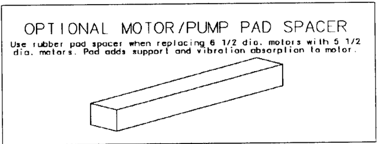

September 2012 New Information

Regal Beloit America, Inc. 531 North Fourth Street Tipp City, OH 45371

1/20 through 5 HP Ratings

NEMA 42, 48, 56 and 140 Frame Sizes

## Your Century Motor

A Century motor is a quality product.  Proper installation and maintenance will assure long life, safe operation and dependable service.

1. Use a motor with a manual reset protector for applications such as compressors conveyers, farm equipment, power tools, etc. where automatic restarting could be hazardous.

## Warning: Failure to follow Instructions and Safe Electrical Procedures Could Result in Serious Injury.

## Inspect Before Installation

1. Examine motor thoroughly to be sure it was not damaged in shipment.
2. Check the motor shaft which should rotate freely when turned by hand.
3. Check nameplate rating. Voltage and frequency must match the power source. Motor hp, speed and rotation must be suitable for the intended use.
4. If wet, damp or removed from a damp location, allow motor to dry before installing.

## Safety Precautions to Avoid Personal Injury

1. Disconnect power source before working on or near a motor or its connected load.
2. Remove shaft key before energizing or bench testing a motor with keyway and key.
3. Install all wiring, fusing and grounding in accordance with National Electrical Code and local requirements.
4. Wire size from service box to power supply outlet for motor should never be smaller than #14 AWG.
5. Keep all parts of body and loose clothing clear of belts, pulleys and other exposed moving parts at all times.
6. Cover or guard all moving parts that could be hazardous.
7. Be careful when touching a motor that could be at or above its normal operating temperature.  The external motor surface could be hot enough to be painful or to cause injury.
8. Do not insert any object into motor at any time.
9. Do not operate motor near flammable or explosive material unless UL listed for hazardous locations.
10. Do not use a motor with an automatic-reset thermal protector where automatic restarting of the motor could be hazardous.

## Thermal Protection

Use a 'Thermally Protected' motor wherever required by safety regulations or an Underwriters' Laboratories Standard, or where severe overloading, jamming or other abnormal operating conditions may occur.

2. A motor with a manual reset protector will have a red button which will pop out when the protector operates. After about a fiveminute cool-down period, the protector can be reset by depressing the red button.
3. Frequent operation of the thermal protector is an indication of an abnormal condition that should be corrected to avoid premature motor failure.

## Location

1. Open motors are intended for use where the environment is relatively clean, dry and noncorrosive.
2. Totally Enclosed motors are intended for use in dirty, damp or oily locations.
3. Explosion-Proof motors are required for use in hazardous locations and specifically where the atmosphere or motor environment may be explosive.
4. Ambient temperature around the motor should not exceed nameplate rating.
5. If installation is outdoors, protect motor with a cover but install cover so that it does not restrict airflow around motor.
6. Do not operate motor in a confined nonventilated area.

## Installation

1. Recheck motor nameplate to be sure that motor type and motor hp, voltage and speed rating are suitable for the intended use.
2. The words 'Air Over' on the nameplate indicate that the motor is suitable for use only on a direct-drive fan or blower where the motor is mounted in the air stream. Other usage of such a motor could cause overheating and premature failure.
3. Check direction of rotation before connecting the motor to the load by clamping motor securely and them momentarily applying power to the motor terminals and observing shaft movement.
4. Fasten motor securely to a rigid base, mounting pad or other means for mounting the motor using the largest bolts that will fit through the mounting holes.
5. Use only the capacitor rating specified for the motor when one is required.
6. Direct-Drive Applications:
- a. Locate fan, blower or other directconnected load for proper running clearance and then fasten securely

## General Purpose and Specialty Motors

- b. Align shafts accurately when a coupling is used and then fasten coupling securely to both the motor shaft and the driven shaft.
- c. Clean all mating surfaces if motor to be face mounted. The assembly should turn freely when parts are properly seated and aligned.
7. Belt-Drive Applications:
- a. Use pulley size that will produce the desired machine speed without overloading the motor.
- b. Mount motor pulley as close as possible to bearing housing to minimize bearing loading, but allow sufficient clearance for rotor end play.
- c. Align pulleys carefully, then fasten securely.
- d. Mount a sleeve-bearing motor so that the direction of belt pull is opposite the oil well holes- (or bearing window) to avoid premature bearing failure.
- e. Tighten belt only enough to prevent slippage. A properly adjusted belt will deflect about ½ inch when light finger pressure is applied midway between the pulleys.

## Electrical Connections

1. Disconnect power source and tag or lock open before starting.
2. Refer to connection diagram on nameplate or on inside of terminal cover to determine proper connections for the voltage source and to obtain the desired speed and direction of rotation. (Rotation of a three-phase motor can be reversed by interchanging any two line leads.)
3. Use a separate branch circuit with adequate capacity for each motor to keep voltage drop to a minimum and to avoid reduced performance and possible overheating of the motor.
4. Grounding:
- a. Connect motor frame to the electrical service ground in accordance with local r National Electrical Code requirements.
- b. Use the green lead or the green screw in the conduit box area, depending on which is provided, for the grounding connection.
- c. Use a size 16AWG or larger wire for grounding.

- d. Connect a separate ground wire to the driven equipment unless there is solid metal-to-metal contact between the motor and the equipment housing.
5. Insulate all unused leads on a motor with individual leads to avoid the possibility of electrical shock or motor burnout.

## Start-up

1. Replace the terminal box cover (if motor has one) before reconnecting the power source.
2. Check direction of rotation.  Stop motor and then reconnect as necessary if rotation is not correct.
3. Check operation of motor to be sure it comes up to speed, runs smoothly and is not overloaded.
4. Shut off power immediately if there is a problem and determine source of trouble before restarting.

## Warranty Period

All Century® motors are warranted against defects in materials and workmanship for a period of twelve (12) months from the date of installation or twenty-four months (24) from the date of manufacture, whichever comes first except for E-Plus®3 Integral Horsepower Motors and HeatMaster® Condenser Fan Motors which are warranted for twenty-four months (24) from date of installation and thirty-six (36) months from date of manufacture, whichever comes first.

## Limitation of Remedy

In the event of a breach of the warranty within the applicable warranty period, Century shall have the option of (1) repairing such motor; (2) supplying an identical or substantially similar replacement motor FOB, Century's factory; or (3) refunding or giving credit for the purchase price of such motor.

The remedy set forth above shall be the sole and exclusive remedy for the motors failing within the applicable warranty period.  Century shall not be liable for any lost profits, loss of use, or any other consequential, special or incidental damages.

## DISCLAIMER OF IMPLIED WARRANTIES

EXCEPT AS MAY BE REQUIRED UNDER APPLICABLE LAW, THE LIMITED WARRANTY SET FORTH ABOVE IS THE EXCLUSIVE WARRANTY PROVIDED WITH THE MOTORS.  ALL OTHER WARRANTIES, WHETERER WRITTEN OR VERBAL, EXPRESSED OR IMPLIED, INCLUDING THE IMPLIED WARRANTIES OF MERCHANTABILITY AND FITNESS FOR A PARTICULAR PURPOSE ARE EXPRESSLY DISCLAIMED BY Regal Beloit EPC, Inc.

## Conditions of Warranty

This limited warranty shall be void and of no effect if:

1. The motor has been subjected to improper handling, storage or installation, or subject to abuse or unauthorized repairs;
2. The motor was not suitable for the application or operated above its rated load; or
3. The motor was subject to water damage including motor bearing failures resulting from pump seal failures.

## Authorized Location

Defective motors which have failed during the applicable warranty period must be returned freight prepaid to a Century's authorized distributor. Call 800-672-6495.

A Regal Brand

## Maintenance

CAUTION: Always disconnect power source before working on or near a motor or its connected load.

1. Motor may require periodic cleaning to prevent the possibility of overheating due to an accumulation of dust and dirt on the windings or on the motor exterior.
2. Sleeve-Bearing Motors lubricated for life require no re-oiling and are constructed without re-oiling tubing. For motors with reoiling tubes or ports, use the following guidelines.
- a. Re-oil annually after the second year of service to extend bearing life for normal duty.
- b. Re-oil every two years for light intermittent duty and at least every five years for light occasional duty.
- c. Add 15 to 20 drops of electric motor oil or an SE grade of SAE 20 nondetergent, motor oil to each bearing when re-oiling.
3.  Ball bearing motors are factory lubricated and require no additional lubrication.

Statement of Warranty Policy

## Caution

1. If motor gets wet, allow it to dry thoroughly before using.
2. Consult a qualified electrician if in doubt how to ground or connect the motor.
3. Any of the following could result in motor damage or failure and could be interpreted as abuse or misapplication of the motor and thus void any warranty that may be provided.
- a. Connection to power source other than the voltage and frequency specified on the nameplate.
- b. Incorrect connection.
- c. Excessive or improper lubrication.
- d. Dropping, carrying by the leads or otherwise mishandling the motor.
- e. Insertion of an object into motor.
- f. Misapplication or improper use.
- g. Improper installation, excessive belt tension, etc.
- h. Failure to insulate unused motor leads.
- i. Use of a capacitor different than the rating specified.

When writing for information, include all information printed on the nameplate and send to:

Regal Beloit America, Inc. 531 North Fourth Street Tipp City, Ohio 45371