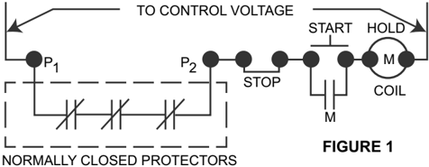
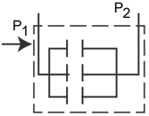
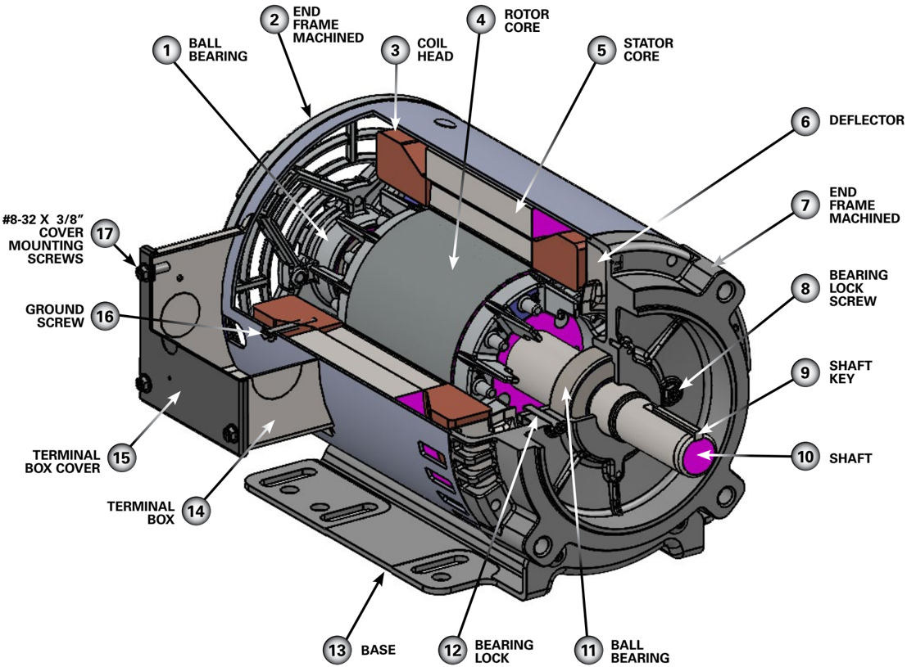

## Installation Operation, and Maintenance Instructions for Standard Induction Motors

Indicates a hazard which, if not avoided, will result in serious injury or death.

Indicates a hazard which, if not avoided, could result in serious injury or death.

## GENERAL SAFETY INSTRUCTIONS

-  Before installing, using, or servicing this product, carefully read and fully understand the instructions including all warnings, cautions, &amp; safety notice statements. To reduce risk of personal injury, death and/or property damage, follow all instructions for proper motor installation, operation and maintenance.
-  Although you should read and follow these instructions, they are not intended as a complete listing of all details for installation,

## TABLE OF CONTENTS

|   1.0 | GENERAL INFORMATION .............................................................1                 | GENERAL INFORMATION .............................................................1                 |                                                                                        |
|-------|----------------------------------------------------------------------------------------------------|----------------------------------------------------------------------------------------------------|----------------------------------------------------------------------------------------|
|       | 1.1                                                                                                | Acceptance.............................................................................1           |                                                                                        |
|       | 1.2                                                                                                | Storage...................................................................................1        |                                                                                        |
|   2.0 | INSTALLATION                                                                                       | INSTALLATION                                                                                       | ...............................................................................1       |
|       | 2.1                                                                                                | Uncrating and Inspection........................................................1                  |                                                                                        |
|       | 2.2                                                                                                | Safety                                                                                             | .....................................................................................2 |
|       | 2.3                                                                                                | Location..................................................................................2        |                                                                                        |
|       | 2.4                                                                                                | Floor Mounting.......................................................................2             |                                                                                        |
|       | 2.5                                                                                                | V-Belt Drive.............................................................................2         |                                                                                        |
|       | 2.6                                                                                                | Direct Connected Drive                                                                             | ..........................................................2                            |
|       | 2.7                                                                                                | Electrical Connections............................................................2                |                                                                                        |
|       | 2.8                                                                                                | Thermal Protector Information................................................2                     |                                                                                        |
|       | 2.9                                                                                                | Changing Rotation..................................................................3               |                                                                                        |
|       | 2.10                                                                                               | Reduced Voltage Starting                                                                           | .......................................................3                               |
|   3.0 | OPERATION ....................................................................................3    | OPERATION ....................................................................................3    |                                                                                        |
|       | 3.1                                                                                                | Before Initial Starting..............................................................3             |                                                                                        |
|       | 3.2                                                                                                | Allowable Voltage and Frequency Range................................3                             |                                                                                        |
|       | 3.3                                                                                                | Cleanliness                                                                                        | .............................................................................3         |
|       | 3.4                                                                                                | Condensation Drain Plugs                                                                           | ......................................................3                                |
|   4.0 | SERVICE .........................................................................................3 | SERVICE .........................................................................................3 |                                                                                        |
|       | 4.1 Troubleshooting.........................................................................4      | 4.1 Troubleshooting.........................................................................4      |                                                                                        |
|       | 4.2 Troubleshooting Table................................................................5         | 4.2 Troubleshooting Table................................................................5         |                                                                                        |

## Regal Rexnord

[regalrexnord.com/brands/leeson](http://www.regalrexnord.com/brands/leeson)

## F O R M

MCM-11067 Revised OCT 2024

Indicates a hazard which, if not avoided, could result in minor or moderate personal injury.

Indicates information considered important, but not hazardrelated (e.g. messages relating to property damage).

operation, and maintenance. If you have any questions concerning any of the procedures, or if you have a safety concern not covered by the instructions, STOP , and contact the motor manufacturer.

-  Perform periodic inspections. Equipment may fail prematurely and could become unsafe if not properly inspected and maintained. Failure to follow this instruction could result in mild or moderate personal injury.

## 1.0  GENERAL INFORMATION

LEESON ®  motors are all fully factory tested and inspected before shipping. Damage during shipment and storage can occur. Motors not correctly matched to the power supply and/or the load will not operate properly. These instructions are intended as a guide to identify and eliminate these problems before they are overlooked or cause further damage.

## 1.1  ACCEPTANCE

Check carefully for any damage that may have occurred in transit. If any damage or shortage is discovered, do not accept until an appropriate notation on the freight bill is made. Any damage discovered after receipt of equipment should be immediately reported to the carrier.

## 1.2  STORAGE

- A. Keep motors clean
1.  Store indoors
2. Keep covered to eliminate airborne dust and dirt
3. Cover openings for ventilation, conduit connections, etc. to prevent entry of rodents, snakes, birds, and insects, etc.
- B. Keep motors dry
1.  Store in a dry area indoors
2. Temperature swings should be minimal to prevent condensation
3. Space heaters are recommended to prevent condensation
4. Treat unpainted flanges, shafts, and fittings with a rust inhibitor
5. Check insulation resistance before putting motor into service (Consult manufacturer for guidelines)
- C. Keep Bearings Lubricated
1.  Once per month, rotate shaft several turns to distribute grease in bearings

## 2.0  INSTALLATION

## 2.1  UNCRATING AND INSPECTION

After uncrating, check for any damage which may have been incurred in handling. The motor shaft should turn freely by hand. Repair or replace any loose or broken parts before attempting to use the motor.

Check to be sure that motor has not been exposed to dirt, grit, or excessive moisture in shipment or storage before installation.

Measure insulation resistance (see operation). Clean and dry the windings as required. Never start a motor which has been wet without having it thoroughly dried.

## 2.2  SAFETY

Motors should be installed, protected and fused in accordance with latest issue of National Electrical Code, NEMA ® * Standard Publication No. MG 2 and local codes.

Eye bolts for lifting lugs are intended for lifting the motor only. These lifting provisions should never be used when lifting or handling the motor with other equipment (i.e. pumps, gear boxes, fans or other driven equipment) as a single unit. Be sure the eye-bolt is fully threaded and tight in its mounting hole.

Eye-bolt lifting capacity ratings are based on a lifting align  ment coincident with the eye-bolt centerline. Eye-bolt capacity reduces as deviation from this alignment increases. See NEMA MG 2.

Frames and accessories of motors should be grounded in accordance with National Electrical Code (NEC) Article 430. For general information of grounding refer to NEC Article 250.

Rotating parts such as pulleys, couplings, external fans, and shaft extensions should be permanently guarded.

## 2.3  LOCATION

In selecting a location for the motor, consideration should be given to environment and ventilation. A motor with the proper enclosure for the expected operating condition should be selected.

The ambient temperature of the air surrounding the motor should not exceed 40°C (104°F) unless the motor has been specially designed for high ambient temperature applica  tions. The free flow of air around the motor should not be obstructed.

The motor should never be placed 'in a room with a hazardous process, or where flammable gases or combustible material may be present, unless it is specifically designed for this type of service.

1. Dripproof (open) motors are intended for use indoors where atmosphere is relatively clean, dry and non-corrosive.
2. Dripproof (open) fire pump motors are to be installed in a Type 2 dripproof environment as defined in NEMA 250.
3. Totally enclosed motors may be installed where dirt, moisture and corrosion are present, or in outdoor locations.
4. Explosion proof motors are built for use in hazardous locations as indicated by Underwriters' label on motor. Consult UL, NEC, and local codes for guidance.

Contact Regal Rexnord  ®  for application assistance.

## 2.4  FLOOR MOUNTING

Motors should be provided with a firm, rigid foundation, with the plane of four mounting pads flat within .010' for 56 to 210 frame; .015' from 250 through 500 frame. This may be accomplished by shims under the motor feet. For special isolation mounting, contact Regal Rexnord for assistance.

## 2.5  V-BELT DRIVE

1. Select proper type and number of belts and sheaves. Excessive belt load will damage bearings. Sheaves should be in accordance to NEMA Spec. MG-1 or as approved by the manufacturer for a specific application.
2. Align sheaves carefully to avoid axial thrust on motor bearing. The drive sheave on the motor should be positioned toward the motor so it is as close as possible to the bearing.
3. When adjusting belt tension, make sure the motor is secured by all mounting bolts before tightening belts.
4. Adjust belt tension to belt manufacturers recommenda  tions. Excessive tension will decrease bearing life.

## 2.6  DIRECT CONNECTED DRIVE

Flexible or solid shaft couplings must be properly aligned for satisfactory operation. On flexible couplings, the clearance between the ends of the shafts should be in accordance with the coupling manufacturer's recommendations or NEMA standards for end play and limited travel in coupling.

## NOTICE:

MISALIGNMENT and RUN-OUT between direct con  nected shafts will cause increased bearing loads and vibra  tion even when the connection

|

is made by means of a flexible coupling. Excessive misalignment will decrease bearing life. Proper alignment, per the specifications of the coupling being used, is critical.

Some large motors are furnished with roller bearings. Roller bearings should not be used for direct drive.

## 2.7  ELECTRICAL CONNECTIONS

WARNING! Install and ground per local and national codes. Consult qualified personnel with questions or if repairs are required.

## WARNING!

1. Disconnect power before working on motor or driven equipment.
2. Motors with automatic thermal protectors will automatically restart when the protector temperature drops sufficiently. Do not use motors with automatic thermal protectors in applications where automatic restart will be hazardous to personnel or equipment.
3. Motors with manual thermal protectors may start unexpectedly after protector trips. If manual protector trips, disconnect motor from power line. After protector cools (five minutes or more) it can be reset and power may be applied to motor.
4. Discharge all capacitors before servicing motor.
5. Always keep hands and clothing away from moving parts.
6. Never attempt to measure the temperature rise of a motor by touch. Temperature rise must be measured by thermometer, resistance, embedded detector, or thermocouple.
7.  Electrical repairs should be performed by trained and qualified personnel only.
8. Failure to follow instructions and safe electrical procedures could result in serious injury or death.

## 9. If safety guards are required, be sure the guards are in use.

1. All wiring, fusing, and grounding must comply with National Electrical Codes and local codes.
2. To determine proper wiring, rotation and voltage connections, refer to the information and diagram on the nameplate, separate connection plate or decal. If the plate or decal has been removed, contact Regal Rexnord ®  for assistance.
3. Use the proper size of line current protection and motor controls as required by the National Electrical Code and local codes. Recommended use is 125% of full load amps as shown on the nameplate for motors with 40°C ambient and a service factor over 1.0. Recommended use is 115% of full load amps as shown on the nameplate for all other motors. Do not use protection with larger capacities than recommended. Three phase motors must have all three phases protected.

## 2.8    THERMAL PROTECTOR INFORMATION

The nameplate will indicate one of the following:

1. Motor is thermally protected
2. Motor is not thermally protected
3. Motor is provided with overheat protective device

For examples, refer to paragraphs below:

1. Motors equipped with built-in thermal protection have 'THERMALLY PROTECTED' stamped on the nameplate. Thermal protectors open the motor circuit electrically when the motor overheats or is overloaded. The protector cannot be reset until the motor cools. If the protector is automatic, it will reset itself. If the protector is manual, press the red button to reset.
2. Motors without thermal protection have nothing stamped on nameplate about thermal protection.
3. Motors that are provided with overheat protective device that does not open the motor circuit directly will indicate 'WITH OVERHEAT PROTECTIVE DEVICE' .
- A. Motors with this type of 'Overheat Protective Device' have protector leads brought out in the motor conduit box marked 'P1'and 'P2' . These leads are intended for connection in series
5. with the stop button of the 3-wire pilot circuit for the magnetic starter which controls the motor. See Figure 1.
- B. The circuit controlled by the above 'Overheat Protective Device' must be limited to a maximum of 600 volts and 360 volt-amps.

Normally Open (N/O) motor thermostates may be used in conjunction with controls installed by original equipment manufacturers.

NORMALLY OPEN PROTECTORS

FIGURE 1A

## 2.9  CHANGING ROTATION

1.  Keep hands and clothing away from rotating parts.
2. Before the motor is coupled to the load, determine proper rotation.
3. Check rotation by jogging or bumping. Apply power to the motor leads for a short period of time, enough to just get motor shaft to rotate a slight amount to observe shaft rotating direction.
4. Three phase - interchange any two (2) of the three (3) line leads. Single phase- reconnect per the connection diagram on the Electrical Codes and local codes.

## 2.10  REDUCED VOLTAGE STARTING

Motors used on reduced voltage starting should be carefully selected based upon power supply limitations and driven load requirements. The motor's starting torque will be reduced when using reduced voltage starting. The elapsed time on the start step should be kept as short as possible and should not exceed 5 seconds. It is recommended that this time be limited to 2 seconds. Contact Regal Rexnord ®  for assistance.

## 3.0  OPERATION

WARNING! Disconnect and lock out before working on motor or driven equipment.

## 3.1  BEFORE INITIAL STARTING

1. If a motor has become damp in shipment or in storage, measure the insulation resistance of the stator winding. Minimum Insulation Resistance =1 + Rated Voltage In Megohms                              1000

Do not attempt to run the motor if the insulation resistance is below this value.

2. If insulation resistance is low, dry out the moisture in one of the following ways:
- a. Bake in oven at temperature not more than 90°C (194°F).
- b. Enclose motor with canvas or similar covering, leaving a hole at the top for moisture to escape, and insert heating units or lamps.
- c. Pass a current at low voltage (rotor locked) through the stator winding. Increase the current gradually until the winding temperature, measured with a thermometer, reaches 90°C (194°F). Do not exceed this temperature.
3. See that voltage and frequency stamped on motor and control nameplates correspond with that of the power line.
4. Check all connections to the motor and control with the wiring diagram.
5. Be sure rotor turns freely when disconnected from the load. Any foreign matter in the air gap should be removed.

|

6. Leave the motor disconnected from the load for the initial start (see following caution). Check for proper rotation. Check for correct voltage (within± 10% of nameplate value) and that it is balanced within 1% at the motor terminals. After the machine is coupled to the load, check that the nameplate amps are not exceeded. Recheck the voltage level and balance under load per the above guidelines.

Shut down the motor if the above parameters are not met or if any other noise or vibration disturbances are present. Consult NEMA ® * guidelines or the equipment manufacturer if any questions exist before operating equipment.

CAUTION! For motors nameplated as 'belted duty only' , do not run motor without belts properly installed.

## 3.2   ALLOWABLE VOLTAGE AND FREQUENCY RANGE

If voltage and frequency are within the following range, motors will operate, but with somewhat different characteris  tics than obtained with correct nameplate values.

1. Voltage:Within10%above or below the value stamped on the nameplate. On three phase systems the voltage should be balanced within 1%. A small voltage unbalance will cause a significant current unbalance.
2. Frequency: Within 5% above or below the value stamped on the nameplate.
3. Voltage and Frequency together: Within 10% (providing frequency above is less than 5%) above or below values stamped on the nameplate.

## 3.3  CLEANLINESS

Keep both the interior and exterior of the motor free from dirt, water, oil and grease. Motors operating in dirty places should be periodically disassembled and thoroughly cleaned.

## 3.4  CONDENSATION DRAIN PLUGS

All explosion proof and some totally enclosed motors are equipped with automatic drain plugs, they should be free of oil, grease, paint, grit and dirt so they don't clog up. The drain system is designed for normal floor (feet down) mounting. For other mounting positions, modification of the drain system may be required, consult Regal Rexnord.

## 4.0  SERVICE

## WARNING!

Disconnect power before working on motor or driven equipment. Motors with automatic thermal protectors will automatically restart when the protector cools. Do not use motors with automatic thermal protectors in applications where automatic restart will be hazardous to personnel or equipment.

## NOTICE:

Over greasing bearings can cause premature bearing and/or motor failure.  The amount of grease added should be carefully controlled.

NOTICE: If lubrication instructions are shown on the motor nameplate, they will supersede this general instruction.

LEESON motors are pregreased with a polyurea mineral oil NGLI grade 2 type grease unless stated otherwise on the motor nameplate. Some compatible brands of polyurea mineral base type grease are: Chevron* SRI #2, Rykon Premium #2, Exxon* Polyrex* EM or  T exaco* Polystar RB.

Motors are properly lubricated at the time of manufacture. It is not necessary to lubricate at the time of installation unless the motor has been in storage for a period of 12 months or longer (refer to lubrication procedure that follows).

## 4.1    TROUBLESHOOTING

## WARNING!

1. Disconnect power before working on motor or driven equipment.
2. Motors with automatic thermal protectors will automatically restart when the protector temperature drops sufficiently. Do not use motors with automatic thermal protectors in applications where automatic restart will be hazardous to personnel or equipment.

## 4.1    TROUBLESHOOTING - Continued

3. Motors with manual thermal protectors may start unexpectedly after protector trips. If manual protector trips, disconnect motor from power line. After protector cools (five minutes or more) it can be reset and power may be applied to motor.
4. Discharge all capacitors before servicing motor.
5. Always keep hands and clothing away from moving parts.
6. Never attempt to measure the temperature rise of a motor by touch. Temperature rise must be measured by thermometer, resistance, embedded detector, or thermocouple.
7. Electrical repairs should be performed by trained and qualified personnel only.
8. Failure to follow instructions and safe electrical procedures could result in serious injury or death.
9. If safety guards are required, be sure the guards are in use.

If trouble is experienced in the operation of the motor, make sure that:

1.  The bearings are in good condition and operating properly.
2. There is no mechanical obstruction to prevent rotation in the motor or in the driven load.
3. The air gap is uniform (consult manufacturer for specifications).
4. All bolts and nuts are tightened securely.
5. Proper connection to drive machine or load has been made. In checking for electrical troubles, be sure that:
-  The line voltage and frequency correspond to the voltage and frequency stamped on the nameplate of the motor.
-  The voltage is actually available at motor terminals.
-  The fuses and other protective devices are in proper condition.
-  All connections and contacts are properly made in the circuits between the control apparatus and motor.

These instructions do not cover all details or variations in equipment nor provide for every possible condition to be met in connection with installation, operation or maintenance. Should additional information be desired for the purchaser's purposes, the matter should be referred to the nearest LEESON Motors sales office.

## TYPICAL CUTAWAY VIEW OF LEESON DESIGNED 56/140T FRAME DRIPPROOF, MOTOR &amp; PARTS DESCRIPTION

|

4

## 4.2  MOTOR TROUBLESHOOTING CHART

Your motor service and any troubleshooting must be handled by qualified persons who have proper tools and equipment.

| TROUBLE                                                  | CAUSE                                                                                   | WHATTO DO                                                                                    |
|----------------------------------------------------------|-----------------------------------------------------------------------------------------|----------------------------------------------------------------------------------------------|
| Motor fails to start                                     | Blown fuses                                                                             | Replace fuses with proper type and rating                                                    |
| Motor fails to start                                     | Overload trips                                                                          | Check and reset overload in starter                                                          |
| Motor fails to start                                     | Improper power supply                                                                   | Check to see that power supplied agrees with motor nameplate and load                        |
| Motor fails to start                                     | Improper line connections                                                               | factor Check connections with diagram supplied with motor                                    |
| Motor fails to start                                     | Open circuit in winding or control                                                      | Indicated by humming sound when switch is closed. Check for loose wiring                     |
| Motor fails to start                                     | switch                                                                                  | connections. Also see that all control contacts are closing                                  |
| Motor fails to start                                     | Mechanical failure                                                                      | Check to see if motor and drive turn freely. Check bearings and lubrication                  |
| Motor fails to start                                     | Short circuited stator                                                                  | Indicated by blown fuses. Motor must be rewound                                              |
| Motor fails to start                                     | Poor stator coil connection                                                             | Remove end bells, locate with test lamp                                                      |
| Motor fails to start                                     | Rotor defective                                                                         | Look for broken bars or end rings                                                            |
| Motor fails to start                                     | Motor may be overloaded                                                                 | Reduce load                                                                                  |
| Motor stalls                                             | One phase may be open                                                                   | Check lines for open phase                                                                   |
| Motor stalls                                             | Wrong application                                                                       | Change type or size. Consult manufacturer                                                    |
| Motor stalls                                             | Overload                                                                                | Reduce load                                                                                  |
| Motor stalls                                             | Low voltage                                                                             | See that nameplate voltage is maintained. Check connection                                   |
| Motor stalls                                             | Open circuit                                                                            | Fuses blown, check overload relay, stator and pushbuttons                                    |
| Motor runs and then dies down                            | Power failure                                                                           | Check for loose connections to line, to fuses and to control                                 |
| Motor does not come up to speed                          | Not applied properly                                                                    | Consult supplier for proper type                                                             |
| Motor does not come up to speed                          | Voltage too low at motor terminals                                                      | Use higher voltage on transformer terminals or reduce load. Check connec-                    |
| Motor does not come up to speed                          | because of line drop Starting load too high                                             | tions. Check conductors for proper size Check load motor is supposed to carry at start       |
| Motor does not come up to speed                          | Broken rotor bars or loose rotor                                                        |                                                                                              |
| Motor does not come up to speed                          |                                                                                         | Look for cracks near the rings. A new rotor may be required as repairs are usually temporary |
| Motor does not come up to speed                          | Open primary circuit                                                                    | Locate fault with testing device and repair                                                  |
| Motor takes too long to accelerate and/or draws high amp | Excessive load                                                                          | Reduce load                                                                                  |
| Motor takes too long to accelerate and/or draws high amp | Low voltage during start                                                                | Check for high resistance. Adequate wire size                                                |
| Motor takes too long to accelerate and/or draws high amp | Defective squirrel cage rotor                                                           | Replace with new rotor                                                                       |
| Motor takes too long to accelerate and/or draws high amp | Applied voltage too low                                                                 | Get power company to increase power tap                                                      |
| Wrong rotation Motor overheats while running under load  | Wrong sequence of phases                                                                | Reverse connections at motor or at switchboard                                               |
|                                                          | Overload                                                                                | Reduce load                                                                                  |
|                                                          | Frame or bracket vents may be clogged with dirt and prevent proper ventilation of motor | Open vent holes and check for a continuous stream of air from the motor                      |
|                                                          | Motor may have one phase open                                                           | Check to make sure that all leads are well connected                                         |
|                                                          | Grounded coil Unbalanced terminal voltage                                               | Locate and repair Check for faulty leads, connections and transformers                       |
| Motor vibrates                                           | Motor misaligned                                                                        | -------Realign                                                                               |
| Motor vibrates                                           | Weak support                                                                            | Strengthen base                                                                              |
| Motor vibrates                                           | Coupling out of balance                                                                 | Re-balance motor                                                                             |
| Motor vibrates                                           | Driven equipment unbalanced                                                             | Re-balance driven equipment                                                                  |
| Motor vibrates                                           | Defective bearings                                                                      | Replace bearing                                                                              |
| Motor vibrates                                           | Bearings not in line                                                                    | Line-up properly                                                                             |
| Motor vibrates                                           | Balancing weights shifted                                                               | Re-balance motor                                                                             |
| Motor vibrates                                           | Polyphase motor running single phase                                                    | Check for open circuit                                                                       |
| Unbalanced line current on                               | Excessive end play                                                                      | Adjust bearing or add shim                                                                   |
| Unbalanced line current on                               | Single phase operation                                                                  | Check for open contacts                                                                      |
| polyphase motors during normal operation                 | Unequal terminal volts                                                                  | Check leads and connections                                                                  |
| polyphase motors during normal operation                 | Unbalanced voltage                                                                      | Correct unbalanced power supply                                                              |
|                                                          | Fan rubbing air shield                                                                  | Remove interference                                                                          |
|                                                          | Fan striking insulation                                                                 |                                                                                              |
| Scraping noise                                           |                                                                                         | Clear fan                                                                                    |
| Scraping noise                                           | Loose on bedplate                                                                       | Tighten holding bolts                                                                        |
| Noisy operation                                          | Air gap not uniform                                                                     | Check and correct bracket fits or bearing. Re-balance                                        |
|                                                          | Rotor unbalance Bent or sprung shaft                                                    | Straighten or replace shaft                                                                  |
|                                                          | Excessive belt pull                                                                     | Decrease belt tension                                                                        |
|                                                          | Pulley diameter too small                                                               | Use larger pulleys                                                                           |
| Hot bearings general                                     | Pulleys too far away                                                                    | Move pulley closer to motor bearing                                                          |
| Hot bearings general                                     | Misalignment Overloaded bearing                                                         | Correct by realignment of drive                                                              |
| Hot bearings ball                                        | Broken ball or rough races                                                              | Check alignment, side and end thrust Replace bearing, first clean housing thoroughly         |

The proper selection and application of products and components, including assuring that the product is safe for its intended use, are the responsibility of the customer.  To view our Application Considerations, please visit https://www.regalrexnord.com/ Application-Considerations.

To view our Standard  Terms and Conditions of Sale, please visit https://www.regalrexnord.com/Terms-and-Conditions-of-Sale.

'Regal Rexnord' is not indicative of legal entity. Refer to product purchase documentation for the applicable legal entity.

*The following tradenames or trademarks are not owned or controlled by Regal Rexnord Corporation: Chevron and  Texaco: Chevron Intellectual Property LLC; Exxon and Polyrex: Exxon Mobil Corporation; NEMA is believed to be a tradename or trademark of National Electrical Manufacturers Association.

